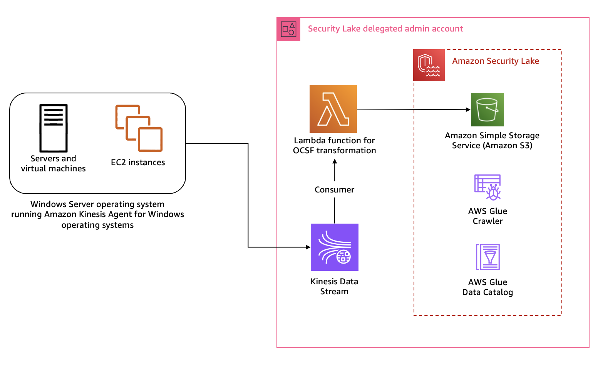
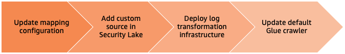
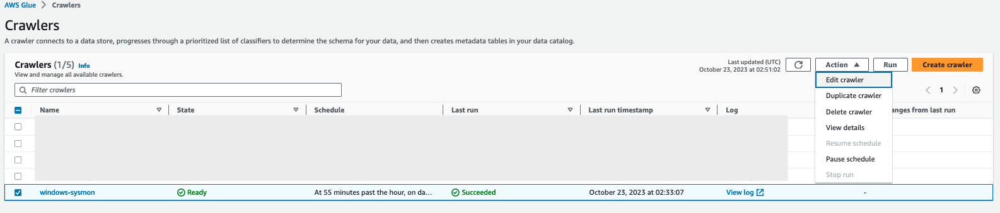
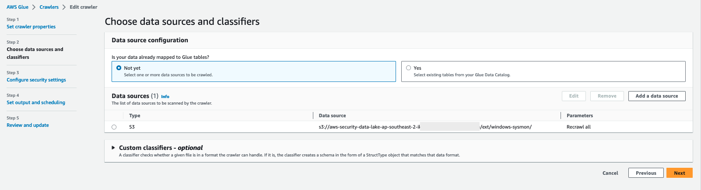
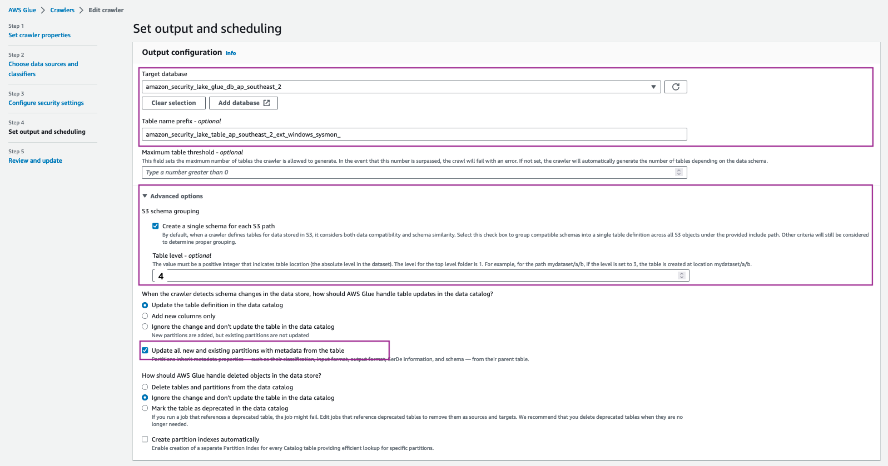

# Microsoft Sysinternals System Monitor (Sysmon) custom source

**OCSF Classes**: FILE_ACTIVITY, PROCESS_ACTIVITY, DNS_ACTIVITY, NETWORK_ACTIVITY

**Custom Source Name**: *windows-sysmon*

> **_Note_** For consistency, ensure that you use the same name (**windows-sysmon**) of the custom source across the deployment steps.

[Microsoft Sysinternals System Monitor (Sysmon)](https://learn.microsoft.com/en-us/sysinternals/downloads/sysmon) is a service that monitors and logs system activity to the Windows event log. It is one of the more commonly used log collection tools used by customers in a Windows Operating System environment as it provides detailed information about process creations, network connections, and changes to file creation time. This host level information can prove crucial during threat hunting scenarios and security analytics.

## Solution overview

The solution for this pattern uses [Amazon Kinesis Data Streams](https://aws.amazon.com/kinesis/data-streams/) and [AWS Lambda](https://aws.amazon.com/lambda/) to implement the schema transformation. Kinesis Data Streams is a serverless streaming data service that makes it easy to capture, process, and store data streams at any scale. Lambda is a serverless, event-driven compute service that lets you run code for virtually any type of application or backend service without provisioning or managing servers. You can integrate Lambda with Kinesis Data Streams to trigger transformation tasks on events captured by the Data Streams.
To stream sysmon logs from the host, you can use [Amazon Kinesis Agent for Microsoft Windows](https://docs.aws.amazon.com/kinesis-agent-windows/latest/userguide/what-is-kinesis-agent-windows.html). You can run this agent on fleets of Windows servers either hosted on-premises or in your AWS environment. 



## Mapping

Logs generated by various sources can have significantly different schemas. Storing logs in different schemas can add considerable overhead around data normalization for security teams before they can derive any significant value from the log information. All log data stored with Security Lake must conform to OCSF. An essential part of bringing custom log data into Security Lake is to map the raw attributes to the OCSF schema. This operation should be non-destructive, which means if there are attributes in the raw log that don't map directly to the OCSF class attributes, you should map those to the `unmapped` attribute.

**Overall event mapping**

|Sysmon EventId	| Event Detail | OCSF Class |
|-|-|-|
| 1 | Process creation | PROCESS_ACTIVITY |
| 2 | A process changed a file creation time | FILE_ACTIVITY |
| 3 | Network connection | NETWORK_ACTIVITY |
| 4 | Sysmon service state changed | PROCESS_ACTIVITY |
| 5 | Process terminated | PROCESS_ACTIVITY |
| 6 | Driver loaded | KERNEL_ACTIVITY |
| 7 | Image loaded | PROCESS_ACTIVITY |
| 8 | CreateRemoteThread | NETWORK_ACTIVITY |
| 9 | RawAccessRead | MEMORY_ACTIVITY |
| 10 | ProcessAccess | PROCESS_ACTIVITY |
| 11 | FileCreate | FILE_ACTIVITY |
| 12 | RegistryEvent (Object create and delete) | FILE_ACTIVITY |
| 13 | RegistryEvent (Value Set) | FILE_ACTIVITY |
| 14 | RegistryEvent (Key and Value Rename) | FILE_ACTIVITY |
| 15 | FileCreateStreamHash | FILE_ACTIVITY |
| 16 | ServiceConfigurationChange | PROCESS_ACTIVITY |
| 17 | PipeEvent (Pipe Created) | FILE_ACTIVITY |
| 18 | PipeEvent (Pipe Connected) | FILE_ACTIVITY |
| 19 | WmiEvent (WmiEventFilter activity detected) | PROCESS_ACTIVITY |
| 20 | WmiEvent (WmiEventConsumer activity detected) | PROCESS_ACTIVITY |
| 21 | WmiEvent (WmiEventConsumerToFilter activity detected) | PROCESS_ACTIVITY |
| 22 | DNSEvent (DNS query) | DNS_ACTIVITY |
| 23 | FileDelete (File Delete archived) | FILE_ACTIVITY |
| 24 | ClipboardChange (New content in the clipboard) | FILE_ACTIVITY |
| 25 | ProcessTampering (Process image change) | PROCESS_ACTIVITY |
| 26 | FileDeleteDetected (File Delete logged) | FILE_ACTIVITY |
| 27 | FileBlockExecutable | FILE_ACTIVITY |
| 28 | FileBlockShredding | FILE_ACTIVITY |
| 29 | FileExecutableDetected | FILE_ACTIVITY |
| 255 | Sysmon Error | PROCESS_ACTIVITY |

**Sample File System Activity event mapping**

1. Event streamed using Kinesis Data Streams

    ```bash
    {"EventId":"1",
    "source_instance_id": "i-1234example56789",
    "Description":"File created:
    RuleName: technique_id=T1574.010,technique_name=Services File Permissions Weakness
    UtcTime: 2023-10-03 23:50:22.438
    ProcessGuid: {78c8aea6-5a34-651b-1900-000000005f01}
    ProcessId: 1128
    Image: C:\Windows\System32\svchost.exe
    TargetFilename: C:\Windows\ServiceState\EventLog\Data\lastalive1.dat
    CreationUtcTime: 2023-10-03 00:04:00.984
    User: NT AUTHORITY\LOCAL SERVICE"}
    ```

2. Attribute mapping for File System Activity class

    |OCSF|Raw|
    |-|-|
    | metadata.profiles | [host] |
    | metadata.version | v1.1.0 |
    | metadata.product.name | System Monitor (Sysmon) |
    | metadata.product.vendor_name | Microsoft Sysinternals |
    | metadata.product.version | v15.0 |
    | severity | Informational |
    | severity_id | 1 |
    | category_uid | 1 |
    | category_name | System Activity |
    | class_uid | 1001 |
    | class_name | File System Activity |
    | time | `<UtcTime>` |
    | activity_id | 1 |
    | actor | {'process': {'name': `<Image>`}} |
    | device | {'type_id': 6} |
    | unmapped | {'pid': `<ProcessId>`, 'uid': `<ProcessGuid>`,  'name': `<Image>`, 'user': `<User>`, 'rulename': `<RuleName>`} |
    | file | { 'name': `<TargetFilename>`, type_id: 1 } |
    | type_uid | 100101 |

    You can follow the same process to map the remaining classes. The `OCSFmapping.json` defined in this documentation maps four events across two OCSF classes (FILE_ACTIVITY and PROCESS_ACTIVITY). You can use the same method to configure mapping for NETWORK_ACTIVITY and DNS_ACTIVITY sysmon events.

## Deployment



#### Update mapping configuration in the transformation function

Copy the configuration json below and replace the contents of the [transformation-function/OCSFmapping.json](./transformation-function/OCSFmapping.json) file.

```json
    { 
        "custom_source_events": {
            "source_name": "windows-sysmon",
            "matched_field": "$.EventId",
            "timestamp": {
                "field": "$.Description.UtcTime",
                "format": "%Y-%m-%d %H:%M:%S.%f"
            },
            "ocsf_mapping": {
                "1": {
                    "schema": "process_activity",
                    "schema_mapping": {   
                        "metadata": {
                            "profiles": "host",
                            "version": "v1.1.0",
                            "product" : {
                                "name": "System Monitor (Sysmon)",
                                "vendor_name": "Microsoft Sysinternals",
                                "version": "v15.0"
                            }
                        },
                        "severity": "Informational",
                        "severity_id": 1,
                        "category_uid": 1,
                        "category_name": "System Activity",
                        "class_uid": 1007,
                        "class_name": "Process Activity",
                        "type_uid": 100701,
                        "time": "$.Description.UtcTime",
                        "activity_id": {
                            "enum": {
                                "evaluate": "$.EventId",
                                "values": {
                                    "1": 1,
                                    "5": 2,
                                    "7": 3,
                                    "10": 3,
                                    "19": 3,
                                    "20": 3,
                                    "21": 3,
                                    "25": 4
                                },
                                "other": 99
                            }
                        },
                        "actor": {
                            "process": "$.Description.Image"
                        },
                        "device": {
                            "type_id": 6,
                            "instance_uid": "$.UserDefined.source_instance_id"
                        },
                        "process": {
                            "pid": "$.Description.ProcessId",
                            "uid": "$.Description.ProcessGuid",
                            "name": "$.Description.Image",
                            "user": "$.Description.User",
                            "loaded_modules": "$.Description.ImageLoaded"
                        },
                        "unmapped": {
                            "rulename": "$.Description.RuleName"
                        } 
                    }
                },
                "5": {
                    "schema": "process_activity",
                    "schema_mapping": {   
                        "metadata": {
                            "profiles": "host",
                            "version": "v1.1.0",
                            "product" : {
                                "name": "System Monitor (Sysmon)",
                                "vendor_name": "Microsoft Sysinternals",
                                "version": "v15.0"
                            }
                        },
                        "severity": "Informational",
                        "severity_id": 1,
                        "category_uid": 1,
                        "category_name": "System Activity",
                        "class_uid": 1007,
                        "class_name": "Process Activity",
                        "type_uid": 100701,
                        "time": "$.Description.UtcTime",
                        "activity_id": {
                            "enum": {
                                "evaluate": "$.EventId",
                                "values": {
                                    "1": 1,
                                    "5": 2,
                                    "7": 3,
                                    "10": 3,
                                    "19": 3,
                                    "20": 3,
                                    "21": 3,
                                    "25": 4
                                },
                                "other": 99
                            }
                        },
                        "actor": {
                            "process": "$.Description.Image"
                        },
                        "device": {
                            "type_id": 6,
                            "instance_uid": "$.source_instance_id"
                        },
                        "process": {
                            "pid": "$.Description.ProcessId",
                            "uid": "$.Description.ProcessGuid",
                            "name": "$.Description.Image",
                            "user": "$.Description.User",
                            "loaded_modules": "$.Description.ImageLoaded"
                        },
                        "unmapped": {
                            "rulename": "$.Description.RuleName"
                        }   
                    }
                },
                "11": {
                    "schema": "file_activity",
                    "schema_mapping": {   
                        "metadata": {
                            "profiles": "host",
                            "version": "v1.1.0",
                            "product" : {
                                "name": "System Monitor (Sysmon)",
                                "vendor_name": "Microsoft Sysinternals",
                                "version": "v15.0"
                            }
                        },
                        "severity": "Informational",
                        "severity_id": 1,
                        "category_uid": 1,
                        "category_name": "System Activity",
                        "class_uid": 1001,
                        "class_name": "File Activity",
                        "type_uid": 100101,
                        "time": "$.Description.UtcTime",
                        "activity_id": {
                            "enum": {
                                "evaluate": "$.EventId",
                                "values": {
                                    "2": 6,
                                    "11": 1,
                                    "15": 1,
                                    "24": 3,
                                    "23": 4
                                },
                                "other": 99
                            }
                        },
                        "actor": {
                            "process": "$.Description.Image"
                        },
                        "device": {
                            "type_id": 6,
                            "instance_uid": "$.source_instance_id"
                        },
                        "file": {
                            "name": "$.Description.TargetFilename",
                            "type_uid": 1
                        },
                        "unmapped": {
                            "rulename": "$.Description.RuleName",
                            "creation_utc_time": "$.Description.CreationUtcTime",
                            "process": {
                                "pid": "$.Description.ProcessId",
                                "uid": "$.Description.ProcessGuid",
                                "name": "$.Description.Image",
                                "user": "$.Description.User"
                            }
                        } 
                    }
                },
                "23": {
                    "schema": "file_activity",
                    "schema_mapping": {   
                        "metadata": {
                            "profiles": "host",
                            "version": "v1.1.0",
                            "product" : {
                                "name": "System Monitor (Sysmon)",
                                "vendor_name": "Microsoft Sysinternals",
                                "version": "v15.0"
                            }
                        },
                        "severity": "Informational",
                        "severity_id": 1,
                        "category_uid": 1,
                        "category_name": "System Activity",
                        "class_uid": 1001,
                        "class_name": "File Activity",
                        "type_uid": 100101,
                        "time": "$.Description.UtcTime",
                        "activity_id": {
                            "enum": {
                                "evaluate": "$.EventId",
                                "values": {
                                    "2": 6,
                                    "11": 1,
                                    "15": 1,
                                    "24": 3,
                                    "23": 4
                                },
                                "other": 99
                            }
                        },
                        "actor": {
                            "process": "$.Description.Image"
                        },
                        "device": {
                            "type_id": 6,
                            "instance_uid": "$.source_instance_id"
                        },
                        "file": {
                            "name": "$.Description.TargetFilename",
                            "type_uid": 1
                        },
                        "unmapped": {
                            "rulename": "$.Description.RuleName",
                            "creation_utc_time": "$.Description.CreationUtcTime",
                            "process": {
                                "pid": "$.Description.ProcessId",
                                "uid": "$.Description.ProcessGuid",
                                "name": "$.Description.Image",
                                "user": "$.Description.User"
                            }
                        } 
                    }
                }
            }
        }
    }
```

#### Add custom source in Security Lake

1. Set up the Glue IAM role for the custom resource by deploying the [ASLCustomSourceGlueRole.yaml](./ASLCustomSourceGlueRole.yaml) CloudFormation template. The template requires the following inputs:
    
    * `CustomSourceName`: This is the name of the custom source you want to add in Security Lake.
    * `ASLCustomLogSourceLocation`: Amazon Security Lake (ASL) S3 bucket name with custom log location without the trailing slash (eg. my_bucket/ext/my_custom_source)

    The template produces one output, `CustomSourceGlueRoleARN`, which is the ARN of the IAM role created for Glue to use with custom sources.
    
    Capture this output for use in the next step.

2. Use AWS CloudShell, a browser based shell, in the Security Lake delegated administrator account to run the command in this step after you have replaced the placeholders.

    * `<SECURITY_LAKE_REGION>` with the region where Security Lake is configured.
    * `<GLUE_IAM_ROLE_ARN>` with the value of the CloudFormation output named `CustomSourceGlueRoleARN` captured in the previous step.
    * `<EXTERNAL_ID>` is an alphanumeric value you can assign to configure fine grained access control. For the self managed custom sources, you can assign it any value you like. In some cases, where you are using an external product, the vendor will supply the [External ID](https://aws.amazon.com/blogs/security/how-to-use-external-id-when-granting-access-to-your-aws-resources/) to you. 
    * `<AWS_IDENTITY_PRINCIPAL>` with the Security Lake delegated administrator AWS Account ID.

    > **_NOTE:_**  For records pertaining to accounts outside of AWS, we recommend using a string such as *_`external`_* or *_`external_<externalAccountId>`_*. You should take care to avoid ambiguity in naming external account IDs so that they do not conflict with AWS account IDs or external account IDs maintained by other identity management systems, as queries across Amazon Security Lake tables may simultaneously cover data across multiple identity management systems.

    ```bash
    aws securitylake create-custom-log-source  \
        --source-name windows-sysmon \
        --configuration crawlerConfiguration={"roleArn=<GLUE_IAM_ROLE_ARN>"},providerIdentity={"externalId=<EXTERNAL_ID>,principal=<AWS_IDENTITY_PRINCIPAL>"} \
        --event-classes FILE_ACTIVITY PROCESS_ACTIVITY DNS_ACTIVITY NETWORK_ACTIVITY \
        --region <SECURITY_LAKE_REGION>
    ```

    The output of the command will reveal the attributes of the associated Glue resources along with Security Lake S3 bucket location and the associated IAM role ARN. Verify with sample output below:

    ```json
    {
        "source": {
            "attributes": {
                "crawlerArn": "arn:aws:glue:region:XXX:crawler/windows-sysmon",
                "databaseArn": "arn:aws:glue:region:XXX:database/amazon_security_lake_glue_db_region",
                "tableArn": "arn:aws:glue:region:XXX:table/amazon_security_lake_table_region_ext_windows_sysmon"
            },
            "provider": {
                "location": "s3://aws-security-data-lake-region-exampleid/ext/windows-sysmon/",
                "roleArn": "arn:aws:iam::XXX:role/AmazonSecurityLake-Provider-windowssysmon-region"
            },
            "sourceName": "windows-sysmon"
        }
    }
    ```

#### Deploy transformation infrastructure

Use AWS SAM CLi to deploy the transformation function and related infrastructure.

1. Sign in to the Security Lake delegated administrator account in your shell/IDE terminal.

2. Deploy the transformation infrastructure using AWS SAM CLI.

    ```bash
    sam build

    sam deploy --guided

    ```

    Parameters:

    * `Stack Name`: Name of the stack.
    * `AWS Region`: Region of deployment.
    * `LogEventSource`: *KinesisDataStream*.
    * `ASLCustomLogSourceLocation`: Location of the custom source logs created by Security Lake when you add a custom source like *aws-security-data-lake-region-exampleid/ext/windows-sysmon*. Refer to the output of the **Add custom source in Security Lake** step.
    * `RawLogS3BucketName`: Leave blank for this pattern.
    * `KinesisUserARNs`: ARNs of the AWS IAM roles associated with the EC2 instances and IAM users associated with Hybrid servers running the Microsoft Windows Operating System. 
    * `KinesisStreamEncryptionKeyAdminARNs`: ARNs of AWS IAM users/roles that will administer the Encryption key for the Kinesis Data Stream.


#### Update the default Glue Crawler

In its default configuration, the Glue crawler created for the custom source does not address complex use cases where a single log source has events mapped to multiple OCSF classes. You will need to change the Crawler configuration for such configurations.

1. In the Security Lake delegated administrator account, navigate to the [AWS Glue service console](https://console.aws.amazon.com/glue/home).
2. Navigate to **Crawlers** in the **Data Catalog** section. Search for the crawler associated with the custom source. It will have the same name as the custom source name. For example, `windows-sysmon`. Select the check box next to the crawler name, then select **Edit Crawler** from the **Action** dropbox.



3. Select **Edit** for the **Step 2: Choose data sources and classifiers** section on the **Review and update** page.
4. In the **Choose data sources and classifiers** section, make the following changes:
    * For **Is your data already mapped to Glue tables?**, change the selection to **Not yet**.
    * for **Data sources**, select **Add a data source**. In the selection prompt, select the Security Lake S3 bucket location as presented in the output of the `create-custom-source` command above. For example, `s3://aws-security-data-lake-region-exampleid/ext/windows-sysmon/`. Make sure you include the path all the way to the custom source name. Then click **Add S3 data source**.

    
    * Select **Next**.
    * On the **Configure security settings** page, leave everything as is, select **Next**.
    * On the **Set output and scheduling** page, select the **Target database** as the Security Lake Glue database.
    * In a separate tab, navigate to AWS Glue > Tables. Copy the name of the custom source table created by Security Lake.
    * Navigate back to the Glue crawler configuration tab, update the **Table name prefix** with the copied table name and add an underscore (`_`) at the end. For example, `amazon_security_lake_table_ap_southeast_2_ext_windows_sysmon_`.
    * Under **Advanced options**, select the checkbox for **Create a single schema for each S3 path** and for **Table level** type in `4`.
    * Ensure you allow the crawler to enforce table schema to the partitions by checking the **Update all new and existing partitions with metadata from the table** checkbox.

    

    > **_Note_** The **Table level** is the location of the path that Glue will evaluate to create separate schemas. This level is calculated from the S3 bucket root not from the relative location of the data source added earlier (`bucketname`(1)/`ext`(2)/`custom_source_name`(3)/`schemas_updated_by_OCSF_transformation_lambda_function`(4)). The OCSF transformation lambda function will filter events based on schemas defined in the mapping configurations.

    * For the **Crawler schedule** section, select **Monthly** from the **Frequency** dropdown. For **Minute**, type in 0. This configuration will run the crawler every month.
    * Select **Next**, then **Update**.

5. You can choose to let the crawler run on a schedule or manually trigger the crawler once the ETL has been deployed and log streaming is configured.

#### Configure hosts to stream log data

1. Install [Kinesis Agent for Microsoft Windows](https://docs.aws.amazon.com/kinesis-agent-windows/latest/userguide/getting-started.html#getting-started-installation). There are three ways you can install the agent on Windows Operating Systems. Using [AWS Systems Manager](https://docs.aws.amazon.com/systems-manager/latest/userguide/), helps automate the deployment and upgrade process. You can also install using a Windows installer package or using PowerShell scripts.

2. Access the remote host running Microsoft Windows Operating System. This solution uses [sysmonconfig.xml](https://github.com/olafhartong/sysmon-modular/blob/master/sysmonconfig.xml) published in the [sysmon-modular](https://github.com/olafhartong/sysmon-modular) project. The project provides a modular configuration along with publishing Tactics, Techniques and Procedures (TTPs) with sysmon events to help in [TTP-based threat hunting](https://www.mitre.org/news-insights/publication/ttp-based-hunting) use cases. If you have your own curated sysmon configuration, you can also choose to use your own configuration.

3. The kinesis agent can use a custom IAM role to stream log data to Kinesis Data Streams. For on-premises servers, you should configure an IAM user that has the permission to assume the `KinesisAgentIAMRole`. On EC2 instances, the instance profile should include permissions to assume the same IAM role.
    
    On the remote host, update the Kinesis agent configuration file `%PROGRAMFILES%\Amazon\AWSKinesisTap\appsettings.json` contents with the contents of `kinesis_agent_configuration.json` file from this repository. Make sure you replace `<LogCollectionStreamName>` and `<KinesisAgentIAMRoleARN>` placeholders with the value of the CloudFormation outputs, `LogCollectionStreamName` and `KinesisAgentIAMRoleARN`, you captured in **Deploy transformation infrastructure** step.

    > **_Note_**: For on-premises servers running the agent, please replace `{ec2:instance-id}` in the _ObjectDecoration_ value under _Sinks_ configuration with the server identifier. For more information, see [Configuring Amazon Kinesis Agent for Microsoft Windows](https://docs.aws.amazon.com/kinesis-agent-windows/latest/userguide/configuring-kinesis-agent-windows.html).

    ```json
    {
        "Sources": [
            {
            "Id": "Sysmon",
            "SourceType": "WindowsEventLogSource",
            "LogName": "Microsoft-Windows-Sysmon/Operational"
            }
        ],
        "Sinks": [
            {
            "Id": "SysmonLogStream",
            "SinkType": "KinesisStream",
            "StreamName": "<LogCollectionStreamName>",
            "ObjectDecoration": "source_instance_id={ec2:instance-id};",
            "Format": "json",
            "RoleARN": "<KinesisAgentIAMRoleARN>"
            }
        ],
        "Pipes": [
            {
            "Id": "JsonLogSourceToKinesisLogStream",
            "SourceRef": "Sysmon",
            "SinkRef": "SysmonLogStream"
            }
        ],
        "SelfUpdate": 0,
        "Telemetrics": { "off": "true" }
    }
    ```
