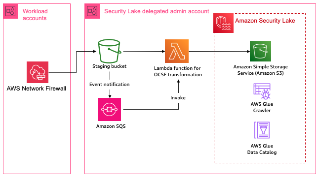
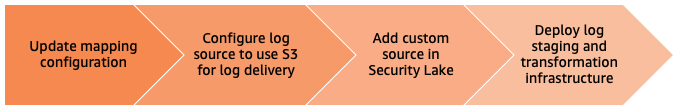
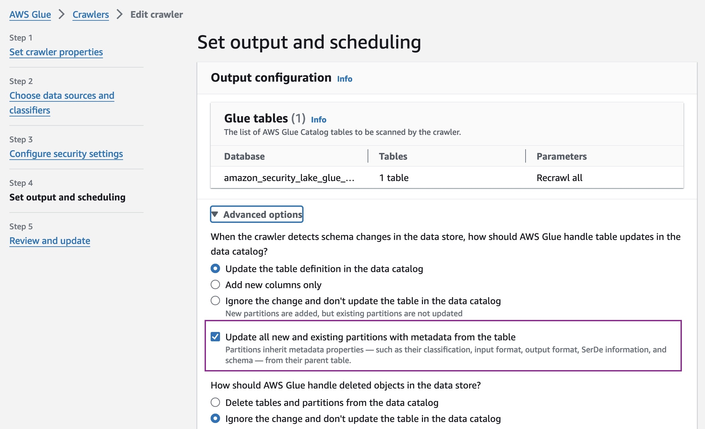

# AWS Network Firewall

**OCSF Classes**: NETWORK_ACTIVITY

**Custom Source Name**: *aws-network-firewall*

> **_Note_** For consistency, ensure that you use the same name (**aws-network-firewal**) of the custom source across the deployment steps.

## Solution overview

The solution for this pattern uses [Amazon Simple Storage Service (Amazon S3)](https://aws.amazon.com/s3/), [Amazon Simple Queue Service (Amazon SQS)](https://aws.amazon.com/sqs/) and [AWS Lambda](https://aws.amazon.com/lambda/) to implement the schema transformation.

To capture raw logs from AWS Network Firewall, you will configure [Network Firewall to log network traffic to S3](https://docs.aws.amazon.com/network-firewall/latest/developerguide/logging-s3.html). This pattern configures an S3 bucket that can be used to stage raw log data from the service, event notifications to SQS that trigger the transformation function.



## Mapping

**Sample Network Activity event mapping for Netflow logs**

1. `Netflow` type log event.

    ```json
    {
        "firewall_name":"firewall",
        "availability_zone":"us-east-1b",
        "event_timestamp":"1601587565",
        "event":{
            "timestamp":"2020-10-01T21:26:05.007515+0000",
            "flow_id":1770453319291727,
            "event_type":"netflow",
            "src_ip":"45.129.33.153",
            "src_port":47047,
            "dest_ip":"172.31.16.139",
            "dest_port":16463,
            "proto":"TCP",
            "netflow":{
                "pkts":1,
                "bytes":60,
                "start":"2020-10-01T21:25:04.070479+0000",
                "end":"2020-10-01T21:25:04.070479+0000",
                "age":0,
                "min_ttl":241,
                "max_ttl":241
            },
            "tcp":{
                "tcp_flags":"02",
                "syn":true
            }
        }
    }
    ```

2. Attribute mapping for Network Activity class

    |OCSF|Raw|
    |-|-|
    | app_name | `<firewall_name>` |
    | cloud.provider | AWS |
    | metadata.profiles | [cloud, firewall] |
    | metadata.product.name | AWS Network Firewall |
    | metadata.product.feature.name | Firewall |
    | metadata.product.vendor_name | AWS |
    | severity | Informational |
    | severity_id | 1 |
    | activity_id | 6 |
    | activity_name | Traffic |
    | category_uid | 4 |
    | category_name | Network Activity |
    | class_uid | 4001 |
    | type_uid | 400106 |
    | class_name | Network Activity |
    | dst_endpoint | {ip: `<event.dest_ip>`, port: `<event.dest_port>`} |
    | src_endpoint | {ip: `<event.src_ip>`, port: `<event.src_port>`} |
    | time | `<event.timestamp>` |
    | connection_info | {uid: `<event.flow_id>`, protocol_name: `<event.proto>`, tcp_flags: `<event.tcp.tcp_flags>`} |
    | start_time | `<event.netflow.start>` |
    | end_time | `<event.netflow.end>` |
    | traffic | {bytes: `<event.netflow.bytes>`, packets: `<event.netflow.packets>`} |
    | unmapped | {availability_zone: `availability_zone`, event_type: `<event.event_type>`, netflow: {age: `<event.netflow.age>`, min_ttl: `<event.netflow.min_ttl>`, max_ttl: `<event.netflow.max_ttl>`}, tcp: {syn: `<event.tcp.syn>`, fin: `<event.tcp.fin>`, ack: `<event.tcp.ack>`, psh: `<event.tcp.psh>`}} |

## Deployment



#### Update mapping configuration in the transformation function

Copy the configuration json below and replace the contents of the [transformation-function/OCSFmapping.json](./transformation-function/OCSFmapping.json) file.

```json
    { 
        "custom_source_events": {
            "source_name": "aws-network-firewall",
            "matched_field": "$.event.event_type",
            "timestamp": {
                "field": "$.event_timestamp",
                "format": "epoch"
            },
            "ocsf_mapping": {
                "netflow": {
                    "schema": "network_activity",
                    "schema_mapping": {   
                        "metadata": {
                            "profiles": "cloud,firewall",
                            "version": "v1.0.0",
                            "product" : {
                                "name": "AWS Network Firewall",
                                "vendor_name": "AWS",
                                "feature": {
                                    "name": "Network Firewall"
                                }
                            }
                        },
                        "app_name": "$.firewall_name",
                        "severity": "Informational",
                        "severity_id": 1,
                        "category_uid": 4,
                        "category_name": "Network Activity",
                        "class_uid": 4001,
                        "class_name": "Network Activity",
                        "type_uid": 400106,
                        "activity_id": 6,
                        "activity_name": "Traffic",
                        "dst_endpoint": {
                            "ip": "$.event.dest_ip",
                            "port": "$.event.dest_port"
                        },
                        "src_endpoint": {
                            "ip": "$.event.src_ip",
                            "port": "$.event.src_port"
                        },
                        "time": "$.event.timestamp",
                        "connection_info": {
                            "uid": "$.event.flow_id",
                            "protocol_name": "$.event.proto",
                            "tcp_flags": "$.event.tcp.tcp_flags"
                        },
                        "start_time": "$.event.netflow.start",
                        "end_time": "$.event.netflow.end",
                        "traffic": {
                            "bytes": "$.event.netflow.bytes",
                            "packets": "$.event.netflow.pkts"
                        },
                        "unmapped": {
                            "app_proto": "$.event.app_proto",
                            "availability_zone": "$.availability_zone",
                            "event_type": "$.event.event_type",
                            "age": "$.event.netflow.age",
                            "min_ttl": "$.event.netflow.min_ttl",
                            "max_ttl": "$.event.netflow.max_ttl",
                            "tcp": {
                                "syn": "$.event.tcp.syn",
                                "fin": "$.event.tcp.fin",
                                "ack": "$.event.tcp.ack",
                                "psh": "$.event.tcp.psh"
                            }
                        }   
                    }
                },
                "alert": {
                    "schema": "network_activity",
                    "schema_mapping": {   
                        "metadata": {
                            "profiles": "cloud,firewall",
                            "version": "v1.0.0",
                            "product" : {
                                "name": "AWS Network Firewall",
                                "vendor_name": "AWS",
                                "feature": {
                                    "name": "Network Firewall"
                                }
                            }
                        },
                        "app_name": "$.firewall_name",
                        "severity": "High",
                        "severity_id": 3,
                        "category_uid": 4,
                        "category_name": "Network Activity",
                        "class_uid": 4001,
                        "class_name": "Network Activity",
                        "type_uid": 400106,
                        "activity_id": 6,
                        "activity_name": "Traffic",
                        "dst_endpoint": {
                            "ip": "$.event.dest_ip",
                            "port": "$.event.dest_port"
                        },
                        "src_endpoint": {
                            "ip": "$.event.src_ip",
                            "port": "$.event.src_port"
                        },
                        "time": "$.event.timestamp",
                        "connection_info": {
                            "uid": "$.event.flow_id",
                            "protocol_name": "$.event.proto"
                        },
                        "tls": {
                            "version": "$.event.tls.version"
                        },
                        "unmapped": {
                            "app_proto": "$.event.app_proto",
                            "action": "$.event.alert.action",
                            "signature_id": "$.event.alert.signature_id",
                            "rev": "$.event.alert.rev",
                            "signature": "$.event.alert.signature",
                            "category": "$.event.alert.category",
                            "tls_inspected": "$.event.alert.tls_inspected",
                            "sni": "$.event.tls.sni",
                            "suricata_severity": "$.event.alert.severity"
                        }
                    }
                }
            }
        }
    }
```

#### Configure Network Firewall to send logs to staging S3 bucket

[Configure AWS Network Firewall to log to Amazon S3](https://docs.aws.amazon.com/network-firewall/latest/developerguide/logging-s3.html).

The transformation function infrastructure deploys a staging S3 bucket for raw log storage. The deployment also configures event notifications with Amazon Simple Queue service (Amazon SQS). The transformation Lambda function is invoked by SQS event notifications when Network Firewall puts log files in the staging S3 bucket.

#### Add custom source in Security Lake

1. Set up the Glue IAM role for the custom resource by deploying the `ASLCustomSourceGlueRole.yaml` CloudFormation template. The template requires the following inputs:
    
    * `CustomSourceName`: This is the name of the custom source you want to add in Security Lake.
    * `ASLCustomLogSourceLocation`: Amazon Security Lake (ASL) S3 bucket name with custom log location without the trailing slash (eg. my_bucket/ext/my_custom_source)

    The template produces one output, `CustomSourceGlueRoleARN`, which is the ARN of the IAM role created for Glue to use with custom sources.
    
    Capture this output for use in the next step.

2. Use AWS CloudShell, a browser based shell, in the Security Lake delegated administrator account to run the command in this step after you have replaced the placeholders.

    * `<SECURITY_LAKE_REGION>` with the region where Security Lake is configured.
    * `<GLUE_IAM_ROLE_ARN>` with the value of the CloudFormation output named `CustomSourceGlueRoleARN` captured in the previous step.
    * `<EXTERNAL_ID>` is an alphanumeric value you can assign to configure fine grained access control. For the self managed custom sources, you can assign it any value you like. In some cases, where you are using an external product, the vendor will supply the [External ID](https://aws.amazon.com/blogs/security/how-to-use-external-id-when-granting-access-to-your-aws-resources/) to you. 
    * `<AWS_IDENTITY_PRINCIPAL>` with the Security Lake delegated administrator AWS Account ID.

    > **_NOTE:_**  For records pertaining to accounts outside of AWS, we recommend using a string such as *_`external`_* or *_`external_<externalAccountId>`_*. You should take care to avoid ambiguity in naming external account IDs so that they do not conflict with AWS account IDs or external account IDs maintained by other identity management systems, as queries across Amazon Security Lake tables may simultaneously cover data across multiple identity management systems.

    ```bash
    aws securitylake create-custom-log-source  \
        --source-name aws-network-firewall \
        --configuration crawlerConfiguration={"roleArn=<GLUE_IAM_ROLE_ARN>"},providerIdentity={"externalId=<EXTERNAL_ID>,principal=<AWS_IDENTITY_PRINCIPAL>"} \
        --event-classes NETWORK_ACTIVITY \
        --region <SECURITY_LAKE_REGION>
    ```

    The output of the command will reveal the attributes of the associated Glue resources along with Security Lake S3 bucket location and the associated IAM role ARN. Verify with sample output below:

    ```json
    {
        "source": {
            "attributes": {
                "crawlerArn": "arn:aws:glue:region:XXX:crawler/aws-network-firewall",
                "databaseArn": "arn:aws:glue:region:XXX:database/amazon_security_lake_glue_db_region",
                "tableArn": "arn:aws:glue:region:XXX:table/amazon_security_lake_table_region_ext_aws_network_firewall"
            },
            "provider": {
                "location": "s3://aws-security-data-lake-region-exampleid/ext/aws-network-firewall/",
                "roleArn": "arn:aws:iam::XXX:role/AmazonSecurityLake-Provider-awsnetworkfirewall-region"
            },
            "sourceName": "aws-network-firewall"
        }
    }
    ```

#### Deploy transformation infrastructure

Use AWS SAM CLi to deploy the transformation function and related infrastructure.

1. Sign in to the Security Lake delegated administrator account in your shell/IDE terminal.

2. Deploy the transformation infrastructure using AWS SAM CLI.

    ```bash
        sam build

        sam deploy --guided
    ```

    Parameters:

    * `Stack Name`: Name of the stack.
    * `AWS Region`: Region of deployment.
    * `LogEventSource`: *S3Bucket*.
    * `ASLCustomLogSourceLocation`: Location of the custom source logs created by Security Lake when you add a custom source like *aws-security-data-lake-region-exampleid/ext/aws-network-firewall*. Refer to the output of the **Add custom source in Security Lake** step.
    * `RawLogS3BucketName`: If you have already configured an S3 bucket for raw log delivery, then use the name of the bucket as the value for this parameter. If you do not specify a value, the deployment will create an S3 bucket for staging the raw logs from the source.
    * `KinesisUserARNs`: Leave blank for this pattern.
    * `KinesisStreamEncryptionKeyAdminARNs`: Leave blank for this pattern.

    > **_Note_:** If you have configured an S3 bucket that you provide as an input for the **RawLogS3BucketName** parameter, please ensure you [configure event notifications with SQS](https://docs.aws.amazon.com/AmazonS3/latest/userguide/enable-event-notifications.html) for the S3 bucket. The deployment creates the SQS queue that you can use.

#### Update the default Glue Crawler

1. In the Security Lake delegated administrator account, navigate to the [AWS Glue service console](https://console.aws.amazon.com/glue/home).
2. Navigate to **Crawlers** in the **Data Catalog** section. Search for the crawler associated with the custom source. It will have the same name as the custom source name. For example, `aws-network-firewall`. Select the check box next to the crawler name, then select **Edit Crawler** from the **Action** dropbox.
3. Navigate to the **Set output and scheduling** section, select **Edit**. In the **Output configuration** section, select the **Advanced options** and select the checkbox for **Update all new and existing partitions with metadata from the table**.

    

4. You can choose to let the crawler run on a schedule or manually trigger the crawler once the ETL has been deployed and log streaming is configured.