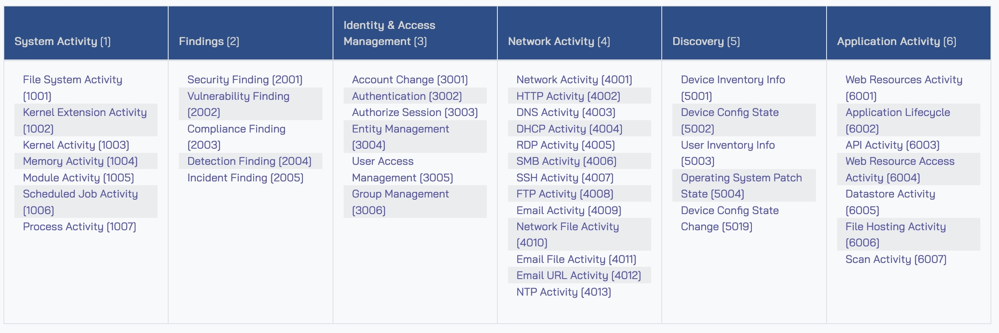

# amazon-security-lake-transformation-library

This repository is a collection of community managed [custom sources](https://docs.aws.amazon.com/security-lake/latest/userguide/custom-sources.html) for Amazon Security Lake.

## Amazon Security Lake custom sources

Customers can configure custom sources to bring their own security data into Security Lake. Enterprise security teams spend a significant amount of time discovering log sources in various formats, depending on the source, and correlating them for security analytics. Custom source configuration helps security teams centralize distributed and disparate log sources in the same format. Security data in Security Lake is centralized and normalized into the [Open Cybersecurity Schema Framework (OCSF)](https://github.com/ocsf) and compressed in open source, column-oriented [Apache Parquet](https://parquet.apache.org/) format for storage optimization and query efficiency. Having log sources in a centralized location and in a singular format can significantly improve security teams’ timelines when performing security analytics. With Security Lake, customers retain full ownership of the security data stored in their account, with complete freedom of choice for analytics. Before we discuss creating custom sources in detail, it’s important to understand the OCSF core schema, which will aid you in mapping attributes and building out the transformation functions for the custom sources of your choice.

## Understanding the Open Cybersecurity Schema Framework (OCSF)

The OCSF project is a vendor-agnostic and open source standard that customers can use to address the complex and heterogeneous nature of security log collection and analysis. Customers can extend and adopt the OCSF [core security schema](https://schema.ocsf.io/) in a range of use cases in their IT environment, application, or solution while complementing their existing security standards and processes. As of this writing, the most recent version of the schema is v1.1.0, and it contains six [categories](https://schema.ocsf.io/1.1.0/categories?extensions=). These are System Activity, Findings, Identity and Access Management, Network Activity, Discovery, and Application Activity. Each category consists of different [classes](https://schema.ocsf.io/1.1.0/classes?extensions=) based on the type of activity, and each class has a unique class UID. For example, File System Activity has a class UID of 1001.



## Pre-requisites
1. **[AWS Organizations](https://docs.aws.amazon.com/organizations/latest/userguide/orgs_tutorials_basic.html) is configured your AWS environment**. AWS Organizations is an AWS account management service that provides account management and consolidated billing capabilities so you can consolidate multiple AWS accounts and manage them centrally.
2. **Security Lake is activated and [delegated administrator is configured](https://docs.aws.amazon.com/security-lake/latest/userguide/multi-account-management.html)**.

    1. Navigate to the AWS Organizations console, and set up an organization with a [Log Archive account](https://docs.aws.amazon.com/prescriptive-guidance/latest/security-reference-architecture/log-archive.html). The Log Archive account should be used as the delegated Security Lake administrator account where you will configure Security Lake. For more information on deploying the full complement of AWS security services in a multi-account environment, see [AWS Prescriptive Guidance | AWS Security Reference Architecture](https://docs.aws.amazon.com/prescriptive-guidance/latest/security-reference-architecture/welcome.html).
    2. Configure permissions for the Security Lake administrator access by using an [AWS Identity and Access Management (IAM) role](https://aws.amazon.com/iam/). This role should be used by security teams to administer Security Lake configuration, including managing custom sources.
    3. Enable Security Lake in the Region of your choice in the Log Archive account. When you configure Security Lake, you can define your collection objectives, which include log sources, the Regions that you want to collect the log sources from and the lifecycle policy you want to assign to the log sources. Security Lake uses [Amazon Simple Storage Service (Amazon S3)](https://aws.amazon.com/s3/) as the underlying storage for the log data. S3 is an object storage service offering industry-leading scalability, data availability, security, and performance. S3 is built to store and retrieve any amount of data from anywhere. Security Lake creates and configures individual S3 buckets in each Region identified in the collection objectives, in the Log Archive account.

3. **Install AWS Serverless Application Model (SAM) command line interface (CLI)**. You will use AWS SAM CLI to deploy the infrastructure required to build the custom source ETL. Follow the AWS SAM development guide for steps to [install the AWS SAM CLI](https://docs.aws.amazon.com/serverless-application-model/latest/developerguide/install-sam-cli.html#install-sam-cli-instructions).

## Understanding the transformation library

The transformation function is a simple Lambda function that reads a mapping configuration file named `OCSFmapping.json`. The mapping configuration is a json formatted file that captures log attribute mapping. the structure of the file is as below:

```json
{ 
    "custom_source_events": {
        "source_name": "<custom-source-name>",
        "matched_field": "<log-attribute-matcher>",
        "timestamp": {
            "field": "<timestamp-field-in-log>",
            "format": "%Y-%m-%d %H:%M:%S.%f | epoch"
        },
        "ocsf_mapping": {
            "<iterator>": {
            }
            ....
        }
    }
}
```

* `custom_source_events`: Top level object key that the transformation function looks for in the configuration file.
* `source_name`: Name of the custom source, this needs to be consistent across the solution deployment across various stages.
* `matched_field`: The name of the field in the logs that is unique in case there are multiple types of logs shipped by the custom source.
* `ocsf_mapping`: The top level object that has the OCSF mapping information.
* `iterator`: The unique identifier, incase the software/product ships multiple types of logs. This iterator stores the mapping configuration for the log type.

**Static values in the configuration file**

Some attributes in the OCSF framework especially `metadata` objects can be mapped to static values. 

For example:

```json
"metadata": {
    "profiles": "host",
    "version": "v1.1.0",
    "product" : {
        "name": "System Monitor (Sysmon)",
        "vendor_name": "Microsoft Sysinternals",
        "version": "v15.0"
    }
}
```
**Derived values in the configuration file**

Attributes derived from log data **must** be preceded with **$.** for the function to identify that the value of the attribute should be fetched from the log data.

For example:

```bash
"ip": "$.event.src_ip"
"port": "$.event.src_port"
```

**Derived values in the configuration file with OCSF defined mapping**

Certain attributes have specific mapping provided by the OCSF class. These attributes are identified by the transformation function using the `enum` type. The enum type has two fields that the function uses to populate the appropriate value - `evaluate` and `values`.

The `evaluate` field identifies the key in the log data, the value of which the function should use to map to the OCSF defined value.
The `values` field maps the value from the log data to the values pre-defined by the OCSF class.

For example:
```json
    "activity_id": {
        "enum": {
            "evaluate": "$.EventId",
            "values": {
                "2": 6,
                "11": 1,
                "15": 1,
                "24": 3,
                "23": 4
            },
            "other": 99
        }
    }
```

## Getting started

To get started, navigate to the custom source readme documentation starting with `CSx-` to find the custom source you would like to configure.

1. Clone the repository in your development environment or IDE of choice.
2. Sign in into the Security Lake delegated administrator account using your shell environment and/or through the AWS management console.
3. Follow the deployment steps in the custom source of your choice. The project supports two patterns for configuring custom sources depending on the raw log source identified by the parameter `LogEventSource`:
    * `KinesisDataStream`: Where Kinesis Data Streams is used for log streaming and ETL. Currently the supported custom sources under this pattern are:
        * [Microsoft Sysinternals System Monitor (Sysmon) with Microsoft Windows operating systems](./CS1-windows-sysmon.md).
    * `S3Bucket`: Where customer managed S3 buckets are used to stage raw logs prior to transformation by the transformation Lambda function.
    Currently the supported custom sources under this pattern are:
        * [AWS Network Firewall](./CS2-aws-network-firewall.md).

    > **_NOTE:_** If you don't find the custom source you are looking for, you can either submit an [issue](https://github.com/aws-samples/amazon-security-lake-transformation-library/issues) to add the custom source or you could contribute to code with a [pull request](https://github.com/aws-samples/amazon-security-lake-transformation-library/pulls).

## Accessing log data

After the log ingestion and transformation pipeline is configured and the crawler has created the Glue tables, you will need to [configure access to the tables from the query tool in Lake Formation](https://docs.aws.amazon.com/lake-formation/latest/dg/granting-table-permissions.html).

Use the link above to configure access to the data. For this solution you will choose the following options for the Lake Formation attributes:

1. For **LF-Tags or catalog resources**, select **Named data catalog resources**.
2. From the **Databases** dropdown, select the Security Lake database starting with *amazon_security_lake_glue_db_*.
3. From the **Tables** dropdown, select the Security Lake custom source tables. For example, *amazon_security_lake_table_ap_southeast_2_ext_windows_sysmon_file_activity*.
4. In the **Table and column permissions** section, choose **Select** and **Describe** permissions for both **Table permissions** and **Grantable permissions**.
5. For **Data permissions**, select **All data access**.

The above configuration will give relevant permissions to the Principals specified.

## Contributing

See [CONTRIBUTING](./CONTRIBUTING.md) for more information.
