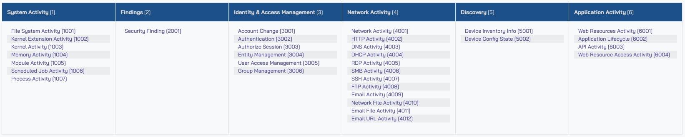

# amazon-security-lake-transformation-library

This repository is a collection of community managed [custom sources](https://docs.aws.amazon.com/security-lake/latest/userguide/custom-sources.html) for Amazon Security Lake.

## Amazon Security Lake custom sources

Customers can configure custom sources to bring their own security data into Security Lake. Enterprise security teams spend a significant amount of time discovering log sources in various formats, depending on the source, and correlating them for security analytics. Custom source configuration helps security teams centralize distributed and disparate log sources in the same format. Security data in Security Lake is centralized and normalized into the [Open Cybersecurity Schema Framework (OCSF)](https://github.com/ocsf) and compressed in open source, column-oriented [Apache Parquet](https://parquet.apache.org/) format for storage optimization and query efficiency. Having log sources in a centralized location and in a singular format can significantly improve security teams’ timelines when performing security analytics. With Security Lake, customers retain full ownership of the security data stored in their account, with complete freedom of choice for analytics. Before we discuss creating custom sources in detail, it’s important to understand the OCSF core schema, which will aid you in mapping attributes and building out the transformation functions for the custom sources of your choice.

## Understanding the Open Cybersecurity Schema Framework (OCSF)

The OCSF project is a vendor-agnostic and open source standard that customers can use to address the complex and heterogeneous nature of security log collection and analysis. Customers can extend and adopt the OCSF [core security schema](https://schema.ocsf.io/) in a range of use cases in their IT environment, application, or solution while complementing their existing security standards and processes. As of this writing, the most recent version of the schema is v1.0.0, and it contains six [categories](https://schema.ocsf.io/1.0.0/categories?extensions=). These are System Activity, Findings, Identity and Access Management, Network Activity, Discovery, and Application Activity. Each category consists of different [classes](https://schema.ocsf.io/1.0.0/classes?extensions=) based on the type of activity, and each class has a unique class UID. For example, File System Activity has a class UID of 1001.

## Pre-requisites
1. **[AWS Organizations](https://docs.aws.amazon.com/organizations/latest/userguide/orgs_tutorials_basic.html) is configured your AWS environment**. AWS Organizations is an AWS account management service that provides account management and consolidated billing capabilities so you can consolidate multiple AWS accounts and manage them centrally.
2. Security Lake is activated and [delegated administrator is configured](https://docs.aws.amazon.com/security-lake/latest/userguide/multi-account-management.html).

    1. Navigate to the AWS Organizations console, and set up an organization with a [Log Archive account](https://docs.aws.amazon.com/prescriptive-guidance/latest/security-reference-architecture/log-archive.html). The Log Archive account should be used as the delegated Security Lake administrator account where you will configure Security Lake. For more information on deploying the full complement of AWS security services in a multi-account environment, see [AWS Prescriptive Guidance | AWS Security Reference Architecture](https://docs.aws.amazon.com/prescriptive-guidance/latest/security-reference-architecture/welcome.html).
    2. Configure permissions for the Security Lake administrator access by using an [AWS Identity and Access Management (IAM) role](https://aws.amazon.com/iam/). This role should be used by security teams to administer Security Lake configuration, including managing custom sources.
    3. Enable Security Lake in the Region of your choice in the Log Archive account. When you configure Security Lake, you can define your collection objectives, which include log sources, the Regions that you want to collect the log sources from and the lifecycle policy you want to assign to the log sources. Security Lake uses [Amazon Simple Storage Service (Amazon S3)](https://aws.amazon.com/s3/) as the underlying storage for the log data. S3 is an object storage service offering industry-leading scalability, data availability, security, and performance. S3 is built to store and retrieve any amount of data from anywhere. Security Lake creates and configures individual S3 buckets in each Region identified in the collection objectives, in the Log Archive account.

## Contributing

See [CONTRIBUTING](./CONTRIBUTING.md) for more information.