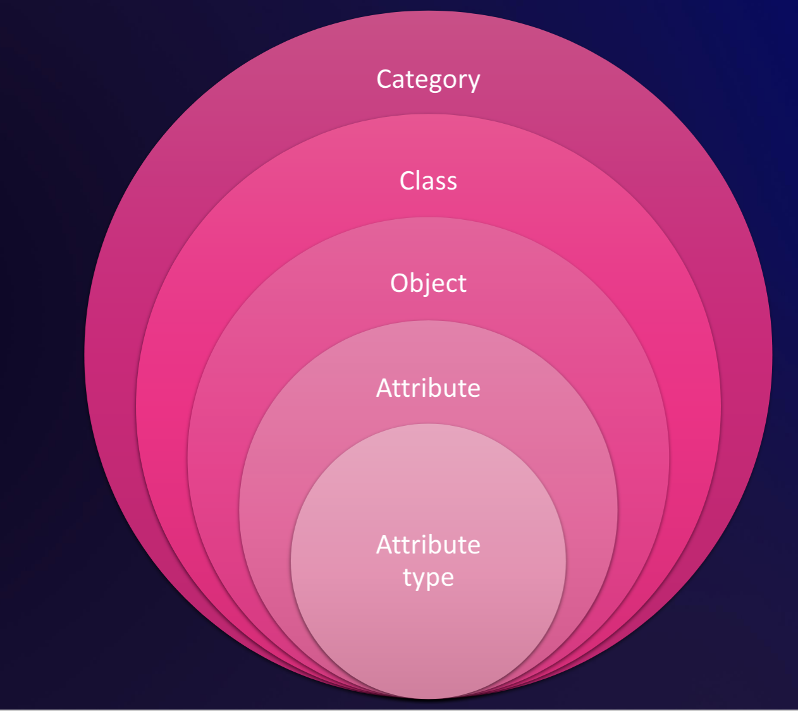
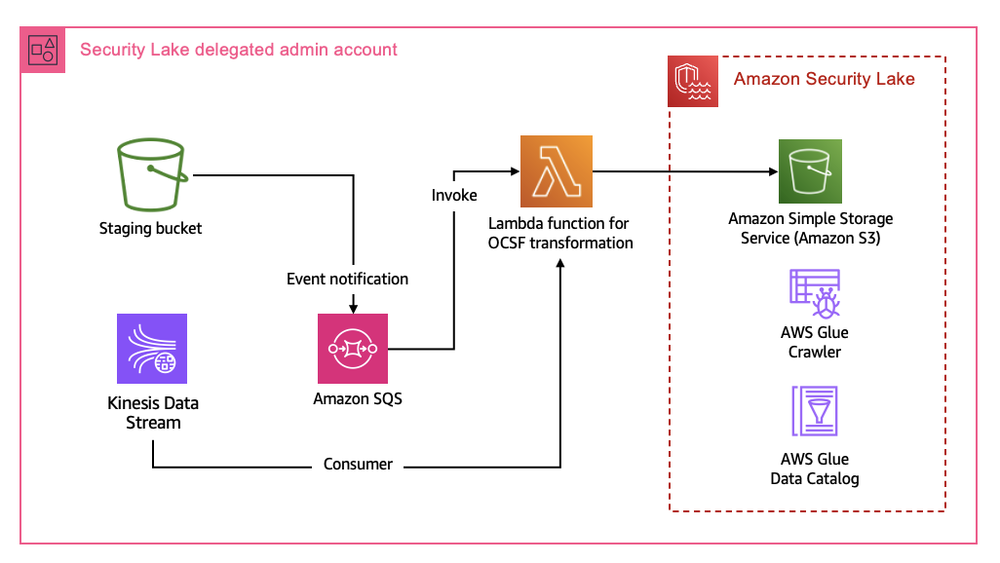
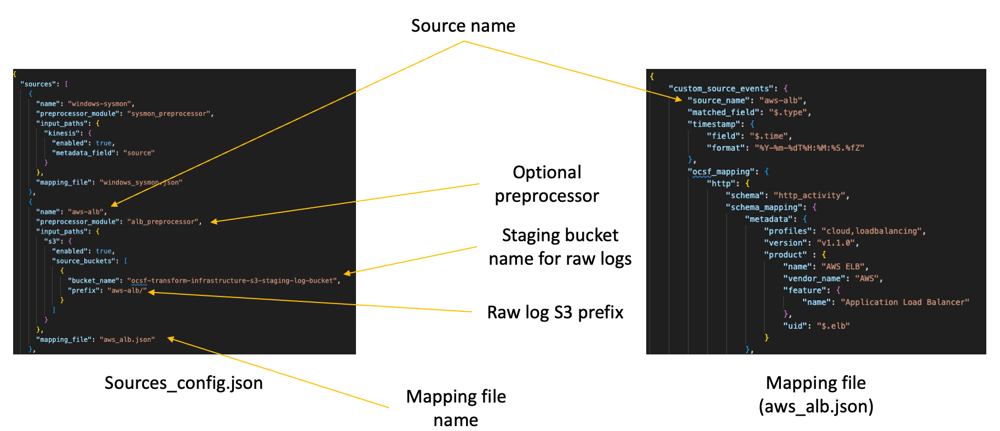
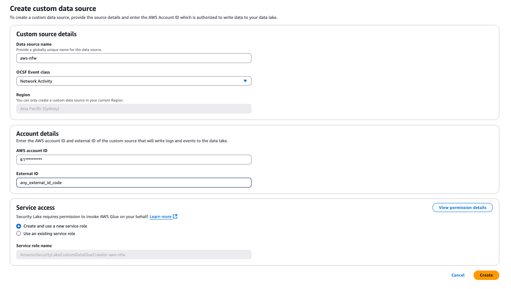
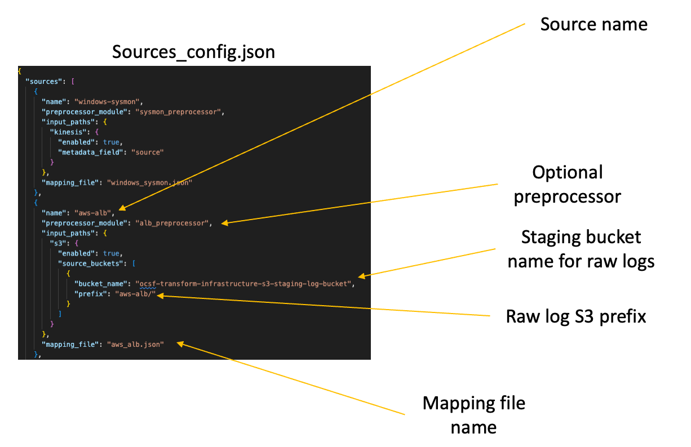

# Amazon Security Lake Transformation Library (v3)

This project provides a solution for transforming various log sources into the Open Cybersecurity Schema Framework (OCSF) format for use with Amazon Security Lake. It enables you to ingest, transform, and store security data from custom sources in a standardized format.

Supported custom sources (**This project produces logs mapped to OCSF v1.1.0.**):

- [Windows Sysmon](./mapping_docs/windows-sysmon-mapping.md)
- [AWS Network Firewall](./mapping_docs/aws-network-firewall-mapping.md)
- [Application Load Balancer](./mapping_docs/application-load-balancer-mapping.md)

> **_NOTE:_** If you have used a previous version of this library to deploy custom sources using AWS Serverless Application Model (AWS SAM), please refer to the [FAQs](#frequently-asked-questions-faqs) on migration path.

## What is Amazon Security Lake?

Amazon Security Lake is a fully managed security data lake service that makes it easier to store, analyze, and manage security data at scale. Security Lake helps security teams centralize security data from cloud, on-premises, and custom sources into a purpose-built data lake stored in your AWS account. Security Lake automates the collection and management of security data across accounts and AWS Regions.

Key benefits of Amazon Security Lake:

- Centralizes security data from AWS services, third-party sources, and custom sources.
- Normalizes data using the OCSF standard format.
- Optimizes storage and query performance with Apache Parquet format.
- Provides full ownership and control of your security data.
- Enables flexible analytics with your preferred tools.

## Understanding Open Cybersecurity Schema Framework (OCSF)

OCSF is an open-source project that provides a standardized schema for security data. It addresses the complex and heterogeneous nature of security log collection and analysis by providing a vendor-agnostic framework.

Key aspects of OCSF:

- Vendor-agnostic schema for security events.
- Organized into categories (System Activity, Findings, Identity and Access Management, etc.).
- Each category contains classes based on activity type (File System Activity, Process Activity, etc.).
- Each class has a unique identifier (class UID).
- Enables consistent security data normalization across different sources.



Logs generated by various sources can have significantly different schemas. Storing logs in different schemas can add considerable overhead around data normalization for security teams before they can derive any significant value from the log information. All log data stored with Security Lake must conform to OCSF. An essential part of bringing custom log data into Security Lake is to map the raw attributes to the OCSF schema. This operation should be non-destructive, which means if there are attributes in the raw log that don't map directly to the OCSF class attributes, you should map those to the `unmapped` attribute.


## Prerequisites

Before deploying this solution, ensure the below:

1. **AWS Organizations configured** in your AWS environment.
2. **[Security Lake activated](https://docs.aws.amazon.com/organizations/latest/userguide/services-that-can-integrate-sl.html#integrate-enable-da-sl)** with a delegated administrator configured in the [Log Archive AWS account](https://docs.aws.amazon.com/prescriptive-guidance/latest/security-reference-architecture/log-archive.html).
3. **[AWS CDK installed](https://docs.aws.amazon.com/cdk/v2/guide/getting_started.html)** on your development machine.
4. **Python 3.8 or higher** installed.
5. **AWS CLI configured** with appropriate credentials.

## Project Structure

```
amazon-security-lake-transformation-library/
├── cdk/                            # CDK deployment code
│   ├── app.py                      # CDK application entry point
│   ├── ocsf_transformation/        # Main stack definition
│   └── requirements.txt            # CDK dependencies
└── transformation_function/        # Lambda function code
    ├── app.py                      # Lambda handler
    ├── mappings/                   # OCSF mapping configurations. **Put all custom source mappings here.**
    ├── preprocessors/              # Source-specific preprocessors. **Add preprocessors here for any new log sources that need it**
    └── sources_config.json         # Source configuration. **Update any new custom source definition here.**
```

## How It Works

#### Solution Architecture



The solution consists of three main components:

1. **Transformation Lambda Function**: Processes incoming logs and transforms them to OCSF format.
2. **Infrastructure (CDK)**: Deploys the necessary AWS resources based on your configuration.
3. **Custom source mappings**: Mapping files are stored in the [mappings](./transformation_function/mappings/) folder under [transformation_function](./transformation_function/) folder.

The transformation process follows these steps:

1. Raw logs are ingested via Kinesis Data Streams or S3 buckets.
2. The Lambda function processes these logs using source-specific preprocessors.
3. The function maps the log fields to OCSF schema using mapping configurations.
4. Transformed data is stored in the Security Lake S3 bucket in Parquet format.

> **_NOTE:_** If you want to add more sources other than the supported after you have deployed the solution, please ensure that you update the mapping in the [mappings](./transformation_function/mappings/) and [sources_config.json](./transformation_function/sources_config.json) folder under [transformation_function](./transformation_function/) folder.


## Deployment Steps

#### STEP 1: Add custom source in Security Lake

Navigate to the Security Lake console. Click **Custom sources** then click **Create custom source**. Update the details of the custom source and click **Create**.



The service will automatically create the Glue IAM role and Crawler configuration for the custom source.

> **_NOTE:_** If you want to create the custom source programmatically, please refer to Q2 in the [FAQs](#frequently-asked-questions-faqs) section.

#### STEP 2: Custom Source Mapping Configuration

The solution uses mapping files, found in [transformation_function/mappings](./transformation_function/mappings/) to transform logs to OCSF format. Here's an example of the mapping structure:

```json
{ 
    "custom_source_events": {
        "source_name": "windows-sysmon",
        "matched_field": "$.EventId",
        "timestamp": {
            "field": "$.Description.UtcTime",
            "format": "%Y-%m-%d %H:%M:%S.%f"
        },
        "ocsf_mapping": {
            "1": {
                "schema": "process_activity",
                "schema_mapping": {   
                    "metadata": {
                        "profiles": "host",
                        "version": "v1.0.0",
                        "product": {
                            "name": "System Monitor (Sysmon)",
                            "vendor_name": "Microsoft Sysinternals",
                            "version": "v15.0"
                        }
                    },
                    "activity_id": {
                        "enum": {
                            "evaluate": "$.EventId",
                            "values": {
                                "1": 1,
                                "5": 2
                            },
                            "other": 99
                        }
                    }
                }
            }
        }
    }
}
```

Key components of the mapping:

- **Static values**: Directly specified in the configuration (e.g., metadata).
- **Derived values**: Prefixed with `$.` to extract from log data (e.g., `$.event.src_ip`).
- **Enum mappings**: Map source values to OCSF-defined values using the `enum` type.

#### STEP 3: AWS Cloud Development Kit (AWS CDK)

1. [Configure AWS credentials](https://docs.aws.amazon.com/cdk/v2/guide/configure-access.html) for CDK to use. This includes using AWS CLI commands like `aws configure` to configure security credentials on your local machine.
2. Clone the repository.
3. Set up a Python virtual environment.

```bash
   cd amazon-security-lake-transformation-library/cdk
   python -m venv .venv
   source .venv/bin/activate  # On Windows, use `.venv\Scripts\activate`
   pip install -r requirements.txt
```

4. [Bootstrap your CDK environment](https://docs.aws.amazon.com/cdk/v2/guide/bootstrapping-env.html). Replace the <AWS Account ID> and <AWS Region> with the values of the environment where you are choosing to deploy the project.

```bash
    cdk bootstrap aws://<AWS Account ID>/<AWS Region>
```

#### Deployment Options

You can deploy the solution using CDK context parameters or environment variables:

**Using CDK Context Parameters**

```bash
cdk deploy \
  --context log_event_source=All \
  --context asl_bucket_location=my-security-lake-bucket \
  --context raw_log_s3_bucket_name=my-existing-bucket \
  --context add_s3_event_notification=true \
  --context kinesis_user_arns="arn:aws:iam::123456789012:user/kinesis-user1" \
  --context stack_name="my-ocsf-transformation" # Optional - used when upgrading from previous version
```

**Using Environment Variables**

```bash
export LOG_EVENT_SOURCE=All
export ASL_BUCKET_LOCATION=my-security-lake-bucket
export RAW_LOG_S3_BUCKET_NAME=my-existing-bucket
export ADD_S3_EVENT_NOTIFICATION=true
export KINESIS_USER_ARNS="arn:aws:iam::123456789012:user/kinesis-user1"

cdk deploy
```

#### Key Parameters

| Parameter | Description | Allowed Values | Default |
|-----------|-------------|----------------|---------|
| `log_event_source` | Source of raw logs | `S3Bucket`, `KinesisDataStream`, `All` | `All` |
| `asl_bucket_location` | Security Lake S3 location | String (required) | - |
| `raw_log_s3_bucket_name` | Existing S3 bucket name | String | `""` (creates new) |
| `add_s3_event_notification` | Add S3 event notification | `true`, `false` | `false` |
| `kinesis_user_arns` | IAM identities for Kinesis | List of ARNs | `[]` |
| `stack_name` | CloudFormation stack name | String | `OcsfTransformationStack` |

## Accessing Transformed Data

After deployment, you'll need to configure access to the transformed data:

1. Configure access to the tables in AWS LakeFormation.
2. Select the Security Lake database (`amazon_security_lake_glue_db_*`).
3. Select the custom source tables (e.g., `amazon_security_lake_table_*_ext_windows_sysmon_*`).
4. Grant appropriate permissions (Select, Describe) to your users or roles.

## Conclusion

The Amazon Security Lake Transformation Library provides a flexible and powerful way to integrate custom security data sources with Amazon Security Lake. By leveraging the OCSF schema, you can standardize your security data for more effective analysis and threat detection.


## Frequently Asked Questions (FAQs)

**Q1: Are there any breaking changes in this update?**

**A1:** **YES, there are breaking changes in this version**, these changes make operating with sources with multiple classes like *windows-sysmon* significantly easier by taking away the need to manually update the underlying AWS Glue Crawler. To upgrade from the previous version, perform the steps below:

1. [Delete the custom source definition in Security Lake](https://docs.aws.amazon.com/security-lake/latest/userguide/delete-custom-source.html). You can use the [service console](https://console.aws.amazon.com/securitylake/) or command line interface. Deleting a custom source does not delete the underlying Glue crawler, custom source IAM role for Glue and S3 location.
2. Navigate to the [AWS Glue service console](https://console.aws.amazon.com/glue). Search for **Crawlers** under **Data Catalog** and delete the crawler associated with the custom source.
3. Create a new custom source in Security Lake, ensure that the name of the custom source is the same as defined in the [sources_config.json](./transformation_function/sources_config.json) file.



**Q2: I use automation with custom source creation. How do I create a custom source without doing console actions?**

**A2:** Use the following steps to automate custom source creation with this project.
    
1. Set up the Glue IAM role for the custom resource by deploying the [ASLCustomSourceGlueRole.yaml](./ASLCustomSourceGlueRole.yaml) CloudFormation template. The template requires the following inputs:
    
    * `CustomSourceName`: This is the name of the custom source you want to add in Security Lake.
    * `ASLCustomLogSourceLocation`: Amazon Security Lake S3 bucket name with custom log location without the trailing slash (eg. my_bucket/ext/my_custom_source)

    The template produces one output, `CustomSourceGlueRoleARN`, which is the ARN of the IAM role created for Glue to use with custom sources.
    
    Capture this output for use in the next step.

2. Use AWS CloudShell, a browser based shell, in the Security Lake delegated administrator account to run the command in this step after you have replaced the placeholders.

    * `<SECURITY_LAKE_REGION>` with the region where Security Lake is configured.
    * `<GLUE_IAM_ROLE_ARN>` with the value of the CloudFormation output named `CustomSourceGlueRoleARN` captured in the previous step.
    * `<EXTERNAL_ID>` is an alphanumeric value you can assign to configure fine grained access control. For the self managed custom sources, you can assign it any value you like. In some cases, where you are using an external product, the vendor will supply the [External ID](https://aws.amazon.com/blogs/security/how-to-use-external-id-when-granting-access-to-your-aws-resources/) to you. 
    * `<AWS_IDENTITY_PRINCIPAL>` with the Security Lake delegated administrator AWS Account ID.

    > **_NOTE:_**  For records pertaining to accounts outside of AWS, we recommend using a string such as *_`external`_* or *_`external_<externalAccountId>`_*. You should take care to avoid ambiguity in naming external account IDs so that they do not conflict with AWS account IDs or external account IDs maintained by other identity management systems, as queries across Amazon Security Lake tables may simultaneously cover data across multiple identity management systems.

    ```bash
    aws securitylake create-custom-log-source  \
        --source-name windows-sysmon \
        --configuration crawlerConfiguration={"roleArn=<GLUE_IAM_ROLE_ARN>"},providerIdentity={"externalId=<EXTERNAL_ID>,principal=<AWS_IDENTITY_PRINCIPAL>"} \
        --event-classes FILE_ACTIVITY PROCESS_ACTIVITY DNS_ACTIVITY NETWORK_ACTIVITY \
        --region <SECURITY_LAKE_REGION>
    ```

    The output of the command will reveal the attributes of the associated Glue resources along with Security Lake S3 bucket location and the associated IAM role ARN. Verify with sample output below:

    ```json
    {
        "source": {
            "attributes": {
                "crawlerArn": "arn:aws:glue:region:XXX:crawler/windows-sysmon",
                "databaseArn": "arn:aws:glue:region:XXX:database/amazon_security_lake_glue_db_region",
                "tableArn": "arn:aws:glue:region:XXX:table/amazon_security_lake_table_region_ext_windows_sysmon"
            },
            "provider": {
                "location": "s3://aws-security-data-lake-region-exampleid/ext/windows-sysmon/",
                "roleArn": "arn:aws:iam::XXX:role/AmazonSecurityLake-Provider-windowssysmon-region"
            },
            "sourceName": "windows-sysmon"
        }
    }
    ```

**Q3: I've deployed the solution but my Athena queries are failing with a HIVE error?**

**A3:** Re-run the Glue Crawler associated with the custom source to update the partitions. Upon successful completion, re-run the Athena queries.