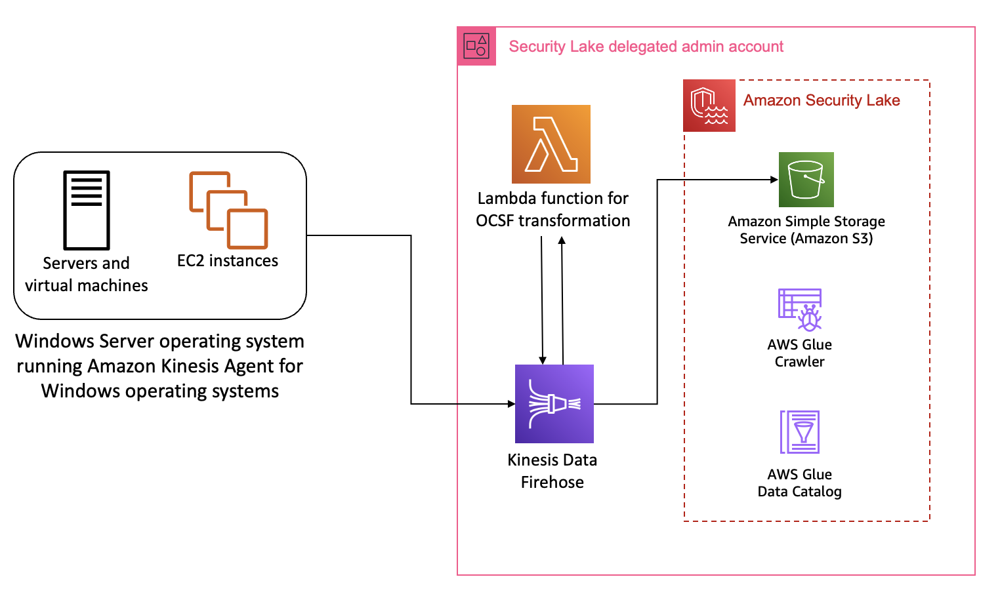
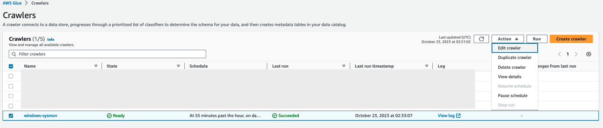
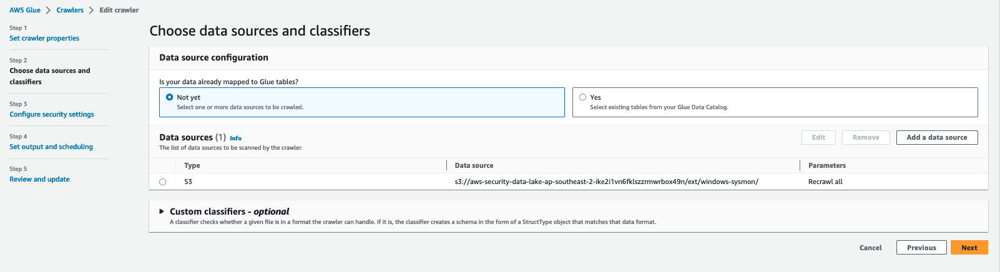
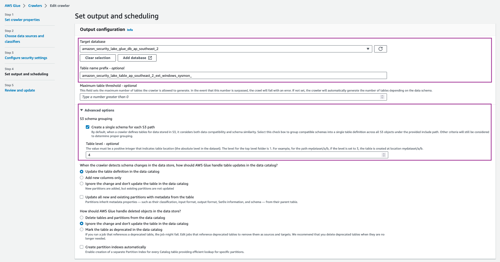

# windows-sysmon

[Microsoft Sysinternals System Monitor (Sysmon)](https://learn.microsoft.com/en-us/sysinternals/downloads/sysmon) is a service that monitors and logs system activity to the Windows event log. It is one of the more commonly used log collection tools used by customers in a Windows Operating System environment as it provides detailed information about process creations, network connections, and changes to file creation time. This host level information can prove crucial during threat hunting scenarios and security analytics.

## Solution overview

The solution for this pattern uses [Amazon Kinesis Data Firehose](https://aws.amazon.com/kinesis/data-firehose/) and [AWS Lambda](https://aws.amazon.com/lambda/) to implement the schema transformation. Kinesis Data Firehose is an extract, transform, and load (ETL) service that reliably captures, transforms, and delivers streaming data to data lakes, data stores, and analytics services. You can stream data into S3 and convert data into required formats like OCSF for analysis without building processing pipelines. Lambda is a serverless, event-driven compute service that lets you run code for virtually any type of application or backend service without provisioning or managing servers. You can integrate Lambda with Kinesis Data Firehose to trigger transformation tasks on events streaming in the Data Firehose.
To stream sysmon logs from the host, you can use [Amazon Kinesis Agent for Microsoft Windows](https://docs.aws.amazon.com/kinesis-agent-windows/latest/userguide/what-is-kinesis-agent-windows.html). You can run this agent on fleets of Windows servers either hosted on-premises or in your AWS environment. 



The above illustration shows the interaction of services involved in building the custom source. We will cover the solution implementation a bit later in this post, first let us understand how you can map sysmon events streaming through Kinesis Data Firehose into the relevant OCSF classes.


## Mapping

**Overall event mapping**

|Sysmon EventId	| Event Detail | OCSF Class |
|-|-|-|
| 1 | Process creation | Process Activity |
| 2 | A process changed a file creation time | File System Activity |
| 3 | Network connection | Network Activity |
| 4 | Sysmon service state changed | Process Activity |
| 5 | Process terminated | Process Activity |
| 6 | Driver loaded | Kernel Activity |
| 7 | Image loaded | Process Activity |
| 8 | CreateRemoteThread | Network Activity |
| 9 | RawAccessRead | Memory Activity |
| 10 | ProcessAccess | Process Activity |
| 11 | FileCreate | File System Activity |
| 12 | RegistryEvent (Object create and delete) | File System Activity |
| 13 | RegistryEvent (Value Set) | File System Activity |
| 14 | RegistryEvent (Key and Value Rename) | File System Activity |
| 15 | FileCreateStreamHash | File System Activity |
| 16 | ServiceConfigurationChange | Process Activity |
| 17 | PipeEvent (Pipe Created) | File System Activity |
| 18 | PipeEvent (Pipe Connected) | File System Activity |
| 19 | WmiEvent (WmiEventFilter activity detected) | Process Activity |
| 20 | WmiEvent (WmiEventConsumer activity detected) | Process Activity |
| 21 | WmiEvent (WmiEventConsumerToFilter activity detected) | Process Activity |
| 22 | DNSEvent (DNS query) | DNS Activity |
| 23 | FileDelete (File Delete archived) | File System Activity |
| 24 | ClipboardChange (New content in the clipboard) | File System Activity |
| 25 | ProcessTampering (Process image change) | Process Activity |
| 26 | FileDeleteDetected (File Delete logged) | File System Activity |
| 27 | FileBlockExecutable | File System Activity |
| 28 | FileBlockShredding | File System Activity |
| 29 | FileExecutableDetected | File System Activity |
| 255 | Sysmon Error | Process Activity |

**Sample File System Activity event mapping**

1. Event streamed using Kinesis Data Firehose

    ```json
    {"EventId":1,
    "source_instance_id": "i-1234example56789",
    "Description":"File created:
    RuleName: technique_id=T1574.010,technique_name=Services File Permissions Weakness
    UtcTime: 2023-10-03 23:50:22.438
    ProcessGuid: {78c8aea6-5a34-651b-1900-000000005f01}
    ProcessId: 1128
    Image: C:\Windows\System32\svchost.exe
    TargetFilename: C:\Windows\ServiceState\EventLog\Data\lastalive1.dat
    CreationUtcTime: 2023-10-03 00:04:00.984
    User: NT AUTHORITY\LOCAL SERVICE"}
    ```

2. Attribute mapping for File System Activity class

    |OCSF| Raw |
    |-|-|
    | metadata.profiles| [host] |
    | metadata.version| v1.0.0-rc2 |
    | metadata.product.name| System Monitor (Sysmon) |
    | metadata.product.vendor_name| Microsoft Sysinternals |
    | metadata.product.version| v15.0 |
    | severity| Informational |
    | severity_id| 1 |
    | category_uid| 1 |
    | category_name| System Activity |
    | class_uid| 1001 |
    | class_name| File System Activity |
    | time| `<UtcTime>` |
    | activity_id| 1 |
    | actor| {'process': {'name': `<Image>`}} |
    | device| {'type_id': 6} |
    | unmapped| {'pid': `<ProcessId>`, 'uid': `<ProcessGuid>`,  'name': `<Image>`, 'user': `<User>`, 'rulename': `<RuleName>`} |
    | file| {'name': , 'type_id': '1'} |
    | type_uid| 100101 |

## Pre-requisites

1. **[AWS Organizations](https://docs.aws.amazon.com/organizations/latest/userguide/orgs_tutorials_basic.html) is configured your AWS environment**. AWS Organizations is an AWS account management service that provides account management and consolidated billing capabilities so you can consolidate multiple AWS accounts and manage them centrally.

2. Security Lake is activated and [delegated administrator is configured](https://docs.aws.amazon.com/security-lake/latest/userguide/multi-account-management.html).

    1. Navigate to the AWS Organizations console, and set up an organization with a [Log Archive account](https://docs.aws.amazon.com/prescriptive-guidance/latest/security-reference-architecture/log-archive.html). The Log Archive account should be used as the delegated Security Lake administrator account where you will configure Security Lake. For more information on deploying the full complement of AWS security services in a multi-account environment, see [AWS Prescriptive Guidance | AWS Security Reference Architecture](https://docs.aws.amazon.com/prescriptive-guidance/latest/security-reference-architecture/welcome.html).
    2. Configure permissions for the Security Lake administrator access by using an [AWS Identity and Access Management (IAM) role](https://aws.amazon.com/iam/). This role should be used by security teams to administer Security Lake configuration, including managing custom sources.
    3. Enable Security Lake in the Region of your choice in the Log Archive account. When you configure Security Lake, you can define your collection objectives, which include log sources, the Regions that you want to collect the log sources from and the lifecycle policy you want to assign to the log sources. Security Lake uses [Amazon Simple Storage Service (Amazon S3)](https://aws.amazon.com/s3/) as the underlying storage for the log data. S3 is an object storage service offering industry-leading scalability, data availability, security, and performance. S3 is built to store and retrieve any amount of data from anywhere. Security Lake creates and configures individual S3 buckets in each Region identified in the collection objectives, in the Log Archive account.

3. Install [Kinesis Agent for Microsoft Windows](https://docs.aws.amazon.com/kinesis-agent-windows/latest/userguide/getting-started.html#getting-started-installation). There are three ways you can install the agent on Windows Operating Systems. Using [AWS Systems Manager](https://docs.aws.amazon.com/systems-manager/latest/userguide/), helps automate the deployment and upgrade process. You can also install using a Windows installer package or using PowerShell scripts.

## Deployment

1. Sign in to the Amazon Security Lake delegated administrator account.

2. Deploy the lambda function in the `lambda` folder. ##### TODO SAM-ify

3. Navigate to AWS CloudFormation and deploy the streaming infrastructure using the CloudFormation template titled `LogIngestionInfrastructure.yaml`.
    
    The CloudFormation template requires the below inputs:
        * `SourceKinesisUserARNs`: This is the list of AWS Principals that are associated with the on-premises servers and EC2 instances that use the Kinesis Agent for Microsoft Windows to stream logs to the Kinesis Data Firehose for log delivery to Security Lake S3 buckets. 
        * `CustomSourceName`: Name of the custom source you will add with Security Lake.
        * `LogCollectionS3BucketARN`: ARN of the Security Lake S3 bucket where the log data will be delivered to.
        * `OCSFConversionLambdaFunctionARN`: ARN of the Lambda function deployed in the previous step for OCSF conversion.
        * `S3LogDeliveryPrefix`: Log delivery prefix for the custom source. This parameter should start with `ext/` and include the custom source name. For example, `ext/<custom_source_name>`.

    The CloudFormation template produces the following outputs:
        * `CustomSourceKDFStreamName`: Name of the Amazon Kinesis Data Firehose delivery stream
        * `KinesisMonitoringPutRecordAlarm`: Name of the Amazon CloudWatch alarm that monitors healthy Kinesis operation.
        * `WindowsSysmonGlueRoleARN`: Name of the IAM role created for Glue to use with custom sources.
        * `KinesisAgentIAMRoleARN`: ARN of the IAM role created for Kinesis agent to assume for log streaming.

4. Capture the outputs of the CloudFormation stack on a scratchpad.

5. In the following command, replace the placeholders as below:
    * `<AWS_IDENTITY_PRINCIPAL>` with the Security Lake delegated administrator AWS Account ID.
    * `<SECURITY_LAKE_REGION>` with the region where Security Lake is configured.
    * `<GLUE_IAM_ROLE_ARN>` with the value of the CloudFormation output named `WindowsSysmonGlueRoleARN` captured in the previous step.
    * `<EXTERNAL_ID>` is an alphanumeric value you can assign to configure fine grained access control. For the `windows-sysmon` custom source, you can assign it any value you like. In some cases, where you are using an external product, the vendor will supply the [External ID](https://aws.amazon.com/blogs/security/how-to-use-external-id-when-granting-access-to-your-aws-resources/) to you. 
    
    > **_NOTE:_**  For records pertaining to accounts outside of AWS, we recommend using a string such as *_`external`_* or *_`external_<externalAccountId>`_*. Partners should take care to avoid ambiguity in naming external account IDs so that they do not conflict with AWS account IDs or external account IDs maintained by other identity management systems, as queries across Amazon Security Lake tables may simultaneously cover data across multiple identity management systems.

    ```bash
    aws securitylake create-custom-log-source  \
        --source-name windows-sysmon \
        --configuration crawlerConfiguration={"roleArn=<GLUE_IAM_ROLE_ARN>"},providerIdentity={"externalId=<EXTERNAL_ID>,principal=<AWS_IDENTITY_PRINCIPAL>"} \
        --event-classes FILE_ACTIVITY PROCESS_ACTIVITY \
        --region <SECURITY_LAKE_REGION>
    ```

6. Use AWS CloudShell, a browser based shell, in the Security Lake delegated administrator account to run the above command after you have replaced the placeholders. The output of the command will reveal the attributes of associate Glue resource along with Security Lake S3 bucket location and the associated IAM role ARN. See example output below:

    ```json
    {
        "source": {
            "attributes": {
                "crawlerArn": "arn:aws:glue:region:XXX:crawler/windows-sysmon",
                "databaseArn": "arn:aws:glue:region:XXX:database/amazon_security_lake_glue_db_region",
                "tableArn": "arn:aws:glue:region:XXX:table/amazon_security_lake_table_region_ext_windows_sysmon"
            },
            "provider": {
                "location": "s3://aws-security-data-lake-region-exampleid/ext/windows-sysmon/",
                "roleArn": "arn:aws:iam::XXX:role/AmazonSecurityLake-Provider-windowssysmon-region"
            },
            "sourceName": "windows-sysmon"
        }
    }
    ```

7. In its default configuration, the Glue crawler created for the custom source does not address complex use cases where a single log source has events mapped to multiple OCSF classes. You will need to change the Crawler configuration for such configurations.

    1. In the Security Lake delegated administrator account, navigate to the [AWS Glue service console](https://console.aws.amazon.com/glue/home).
    2. Navigate to **Crawlers** in the **Data Catalog** section. Search for the crawler associated with the custom source. It will have the same name as the custom source name. For example, `windows-sysmon`. Select the check box next to the crawler name, then select **Edit Crawler** from the **Action** dropbox.

    

    3. Select **Edit** for the **Step 2: Choose data sources and classifiers** section on the **Review and update** page.
    4. In the **Choose data sources and classifiers** section, make the following changes:
        * For **Is your data already mapped to Glue tables?**, change the selection to **Not yet**.
        * for **Data sources**, select **Add a data source**. In the selection prompt, select the Security Lake S3 bucket location as presented in the output of the `create-custom-source` command above. For example, `s3://aws-security-data-lake-region-exampleid/ext/windows-sysmon/`. Make sure you include the path all the way to the custom source name. Then click **Add S3 data source**.

        
        * Select **Next**.
        * On the **Configure security settings** page, leave everything as is, select **Next**.
        * On the **Set output and scheduling** page, select the **Target database** as the Security Lake Glue database.
        * In a separate tab, navigate to AWS Glue > Tables. Copy the name of the custom source table created by Security Lake.
        * Navigate back to the Glue crawler configuration tab, update the **Table name prefix** with the copied table name and add an underscore (`_`) at the end. For example, `amazon_security_lake_table_ap_southeast_2_ext_windows_sysmon_`.
        * Under **Advanced options**, select the checkbox for **Create a single schema for each S3 path** and for **Table level** type in `4`. For the **Crawler schedule**, select the **Frequency** as **Hourly**. For **Minute**, type in 0. This configuration will run the crawler every hour.

        

        > **_Note_** The **Table level** is the location of the path that Glue will evaluate to create separate schemas. This level is calculated from the S3 bucket root not from the relative location of the data source added earlier. The OCSF transformation lambda function will filter events based on schemas defined in the mapping configurations.

        * Select **Next**, then **Update**.
    
    5. You can choose to let the crawler run on a schedule or manually trigger the crawler once the ETL has been deployed and log streaming is configured.

8. Access the remote host running Microsoft Windows Operating System. This solution uses [sysmonconfig.xml](https://github.com/olafhartong/sysmon-modular/blob/master/sysmonconfig.xml) published in the [sysmon-modular](https://github.com/olafhartong/sysmon-modular) project. The project provides a modular configuration along with publishing Tactics, Techniques and Procedures (TTPs) with sysmon events to help in [TTP-based threat hunting](https://www.mitre.org/news-insights/publication/ttp-based-hunting) use cases. If you have your own curated sysmon configuration, you can also choose to use your own configuration.

9. On the remote host, update the Kinesis agent configuration file contents with the contents of `kinesis_agent_configuration.json` file from this repository. Make sure you replace `<CustomSourceKDFStreamName>` placeholder with the value of the CloudFormation output `CustomSourceKDFStreamName` and `<KinesisAgentIAMRoleARN>` placeholder with the value of the CloudFormation output `KinesisAgentIAMRoleARN` from Step 3.

    > **_Note_**: For on-premises servers running the agent, please replace `{ec2:instance-id}` in the _ObjectDecoration_ value under _Sinks_ configuration with the server identifier. For more information, see [Configuring Amazon Kinesis Agent for Microsoft Windows](https://docs.aws.amazon.com/kinesis-agent-windows/latest/userguide/configuring-kinesis-agent-windows.html).

    ```json
    {
        "Sources": [
            {
            "Id": "Sysmon",
            "SourceType": "WindowsEventLogSource",
            "LogName": "Microsoft-Windows-Sysmon/Operational"
            }
        ],
        "Sinks": [
            {
            "Id": "SysmonLogStream",
            "SinkType": "KinesisFirehose",
            "StreamName": "<CustomSourceKDFStreamName>",
            "ObjectDecoration": "source_instance_id={ec2:instance-id};",
            "Format": "json",
            "RoleARN": "<KinesisAgentIAMRoleARN>"
            }
        ],
        "Pipes": [
            {
            "Id": "JsonLogSourceToFirehoseLogStream",
            "SourceRef": "Sysmon",
            "SinkRef": "SysmonLogStream"
            }
        ],
        "SelfUpdate": 0,
        "Telemetrics": { "off": "true" }
    }
    ```